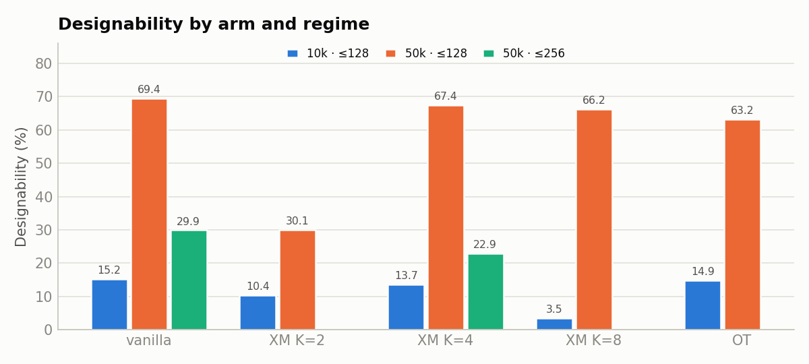
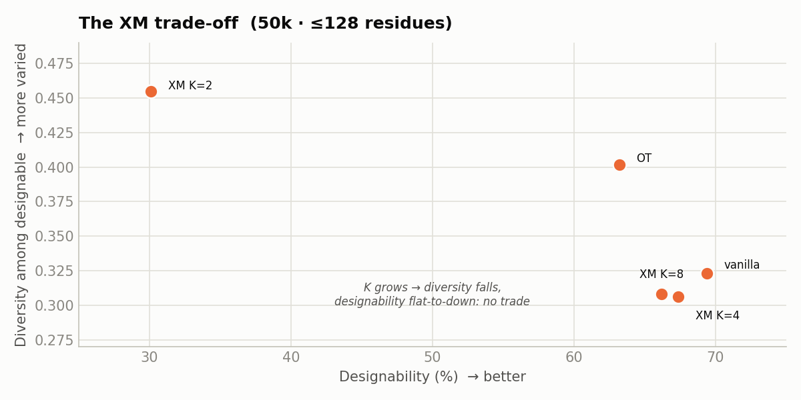

# Explorative Modeling (XM) for FrameFlow — cross-regime summary

**Verdict:** across every regime tested — 10k & 50k steps, ≤128 & ≤256 residues — plain **vanilla** independent coupling wins. XM never beats it; larger K trades structural diversity for no designability gain, and at ≤256 XM is clearly *worse*. The null result is not a small-protein artifact. **Experiment complete.**

## Designability by arm and regime

## The XM trade-off (50k · ≤128 residues)

## All numbers

| Arm | 10k ≤128 | 50k ≤128 | 50k ≤256 | Div(des) 50k≤128 | Div(des) 50k≤256 | Novelty 50k≤128 |
|-----|-----------|-----------|-----------|------------------|------------------|------------------|
| vanilla | 15.2% | 69.4% | 29.9% | 0.323 | 0.733 | 0.197 |
| XM K=2 | 10.4% | 30.1% | — | 0.455 | — | 0.215 |
| XM K=4 | 13.7% | 67.4% | 22.9% | 0.306 | 0.674 | 0.203 |
| XM K=8 | 3.5% | 66.2% | — | 0.308 | — | 0.205 |
| OT | 14.9% | 63.2% | — | 0.402 | — | 0.227 |

Designability = % designable (scRMSD < 2 Å), n=402/arm. Diversity (des.) = distinct foldseek clusters ÷ designable count. Novelty = 1 − max TM-score to the full PDB. “—” = arm not run in that regime. SE(3)-OT (10k only) = 6.0%, omitted.

Source: `docs/xm_explorative_modeling.md`, `xm_eval_results/eval50k/eval50k_full_summary.csv`, `xm_eval_results/eval256/eval256_summary.csv`. Interactive version: `docs/xm_cross_regime_summary.html`.
