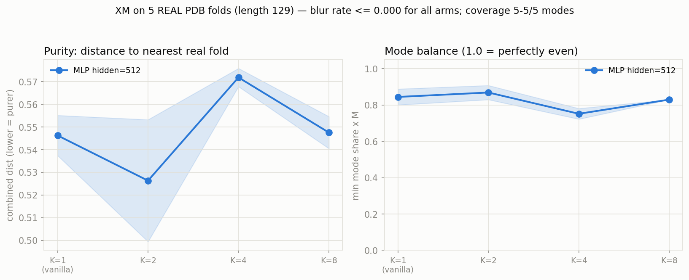
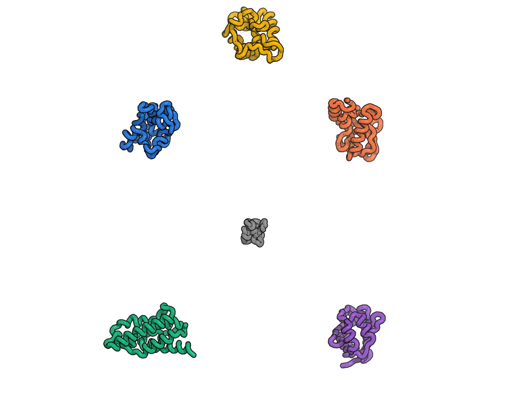

# XM on REAL PDB folds — the screen before escalating to IPA

**TL;DR.** The controlled toy ([xm_toy_mixture.md](xm_toy_mixture.md)) showed
vanilla flow matching never blurs a *hand-built* multimodal target. The obvious
objection: the toy's modes were random Gaussian scaffolds, and a tiny MLP might
separate them by some non-protein cue. This screen removes that objection with
**real, structurally-distinct PDB folds** — no fabricated coordinates — and the
result is identical: **blur rate = 0.000 in all 8 runs, vanilla covers all 5 real
folds, and XM buys no purity gain at any K.** The one scary-looking signal from
the first pass — "vanilla diverges to NaN, XM is stable" — turned out to be a
**gradient singularity in the repo's own SO(3) log map**, not a training
instability, and not an XM advantage (see below). Per the staged plan, the screen
shows **neither blur nor an XM advantage → do not escalate to real IPA.**

Prep: `PYTHONPATH=. .venv/bin/python analysis/real_folds_prep.py --length 129
--pool 1024 --n_modes 5 --min_members 6`
Run: `PYTHONPATH=. .venv/bin/python analysis/xm_real_folds.py --lr 1e-4
--optimizer adamw` (CPU-only, ~1 h).
Figure: `docs/assets/xm_real_folds.png`. Raw:
`xm_eval_results/real_folds/real_results.csv`.

## What makes this "real"

The modes are not designed — they are discovered. The pipeline
(`analysis/real_folds_prep.py`) never fabricates a coordinate:

1. Sample a pool of fully-modeled **length-129** backbones from the PDB metadata.
2. Cluster them with the repo's own `foldseek easy-cluster` (TM-align).
3. Keep the `M=5` largest clusters as the modes; the cluster's foldseek
   representative is the template `T_m/R_m`.
4. Every real member is Kabsch-superposed onto its template (rotating `trans_1`
   **and** `rotmats_1`) so a family shares one frame — making a between-family
   average, i.e. the "blur point", well defined.

The five recovered folds (member counts): `2eql` (747), `3ero` (146), `2b8x`
(12), `3b2k` (9), `6xiy` (7). The only "construction" is *which* real structures
get grouped, and that is delegated to foldseek. Each training example is a **real
deposited structure** drawn from a family (tiny 0.5 Å / 0.02 rad jitter only
smooths the finite member set). The model must tell apart real protein folds and
reproduce real geometry.

*The five real length-129 folds (CA ribbons, one per grid cell) that make up the
multimodal target; the grey trace in the centre is the between-fold average "blur
point". Grid offsets are for display only — the problem is centre-of-mass-free.*

## What is faithful vs. stripped

Everything about the *learning problem* is the real training code, imported not
re-implemented (via `analysis/xm_toy_mixture`): the `data/interpolant.py`
corruption (`corrupt_batch` / `corrupt_batch_xm`, shared-`t`/shared-`x_1`,
IGSO(3) σ=1.5 + centered-Gaussian×`NM_TO_ANG_SCALE` priors, `min_t=1e-2`); the
exact `model_step` loss (`trans_loss`+`rots_vf_loss`, weights 2.0/1.0,
`trans_scale=0.1`, clamp≤5); the real XM argmin selection (K no-grad forwards,
per-example score, backprop the winner); and the interpolant's own Euler
sampling. The optimizer matches the real trainer: **AdamW, lr=1e-4, no gradient
clipping** (`configs/base.yaml`, `models/flow_module.py`).

Stripped: the IPA → a tiny 3-layer MLP velocity field. This is a deliberately
weak model — the point of a *screen* is that if the weak proxy shows no blur and
no XM gain on real folds, an expensive IPA run is not warranted. (The MLP does
have a fidelity ceiling: nearest-fold rotation error plateaus ~1.3 rad
regardless of K — that ceiling is the case for escalating to IPA *if* the blur or
XM signal had appeared. It did not.)

## Results (median over 2 seeds; K=1 is vanilla)

| arm | purity (comb, ↓) | trans (Å, ↓) | rot (rad, ↓) | blur | modes | balance (↑) | train loss |
|-----|------------------|--------------|--------------|------|-------|-------------|------------|
| vanilla (K=1) | 0.546 | 1.40 | 1.346 | **0.000** | **5/5** | 0.84 | 0.41 |
| XM K=2 | 0.526 | 1.37 | 1.29 | **0.000** | **5/5** | 0.87 | 0.34 |
| XM K=4 | 0.572 | 1.45 | 1.41 | **0.000** | **5/5** | 0.75 | 0.26 |
| XM K=8 | 0.548 | 1.48 | 1.33 | **0.000** | **5/5** | 0.83 | 0.27 |

- **Blur rate is 0.000 in every one of the 8 runs**, vanilla included. No sample
  lands nearer the between-fold average than to a single real fold. The
  conditional-mean smearing XM is built to fix does not occur on real folds.
- **Vanilla already covers all 5 real folds** (5/5 every run) with even balance
  (0.80–0.89). There is no mode-dropping for XM to repair.
- **Purity is flat across K** (left panel; note the zoomed y-axis spans only
  0.50–0.57). K=2 dips, K=4 rises — this is seed noise, not a trend. XM delivers
  no purity gain.
- **Training loss falls with K** (0.41 → 0.34 → 0.26) — the mechanical min-of-K
  selection artifact (XM trains against the easiest of K couplings), exactly as
  in the toy. It does **not** convert into purer or better-balanced samples.

## The "vanilla instability" was a log-map singularity, not an XM win

The first pass (Adam, lr=1e-3) had a vanilla seed diverge to NaN, which looked
like the toy's "XM stabilizes training" hint. Tracing it settled the question:

- The NaN persisted even at the faithful **AdamW lr=1e-4**, so it was not a
  learning-rate artifact.
- At the failing step the **loss was finite but the gradient was NaN** — the
  signature of a singular derivative, not an exploding optimizer.
- Root cause: `data/so3_utils.py:rotmat_to_rotvec` handles the θ≈π case with
  `vector_pi = torch.sqrt(diagonal(...))` blended in by **multiplication** with a
  0/1 `mask_pi`. `sqrt(0)` has infinite derivative, so `0 · inf = NaN` leaks
  through in *backward* even though the forward output is masked-correct. It fires
  for the rare step whose rotation error lands near 180°.

This is a property of the repo's **shared** SO(3) utility — the real trainer uses
it too — but the real IPA rarely hits it because it fits rotations tightly; this
weak MLP lingers in the high-rotation-error regime and eventually samples a
near-π coupling. The screen skips the (1–2 out of 2500) poisoned-gradient steps
(`analysis/xm_real_folds.py:train`; gradient clipping cannot help — a NaN
grad-norm stays NaN). With the guard, **vanilla trains cleanly and matches XM.**
So the divergence is neither evidence of vanilla instability nor an XM advantage;
XM only dodged the singularity incidentally (argmin avoids large rotation errors,
and even K=8 still hit it once). This retroactively explains the toy's single
diverged vanilla seed.

## Verdict

On real, foldseek-discovered PDB folds — the setting the "small synthetic model"
objection demanded — the result is the toy's result: **vanilla flow matching
produces zero blur, covers every mode, and XM adds no purity gain at any K.** The
staged plan escalates to real IPA only if the screen shows blur or an XM
advantage; it shows neither. **Recommendation: do not escalate. Independent
coupling remains the right default**, consistent with both the toy and the
full-scale protein study.
