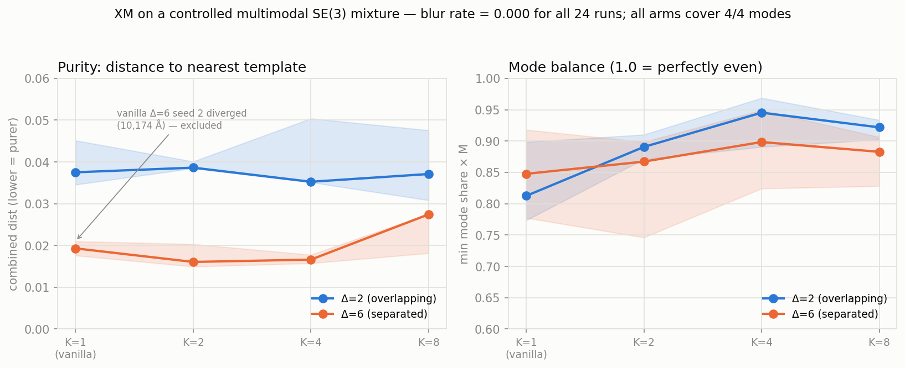
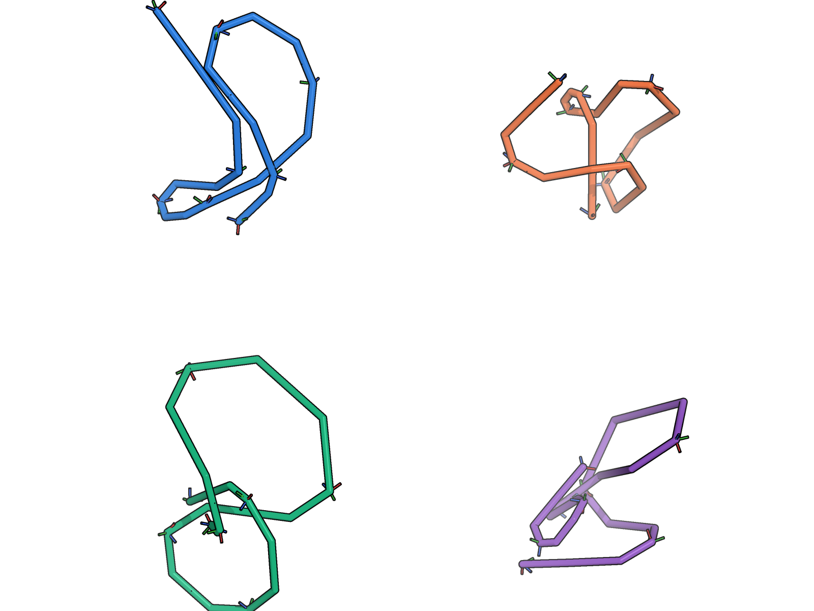
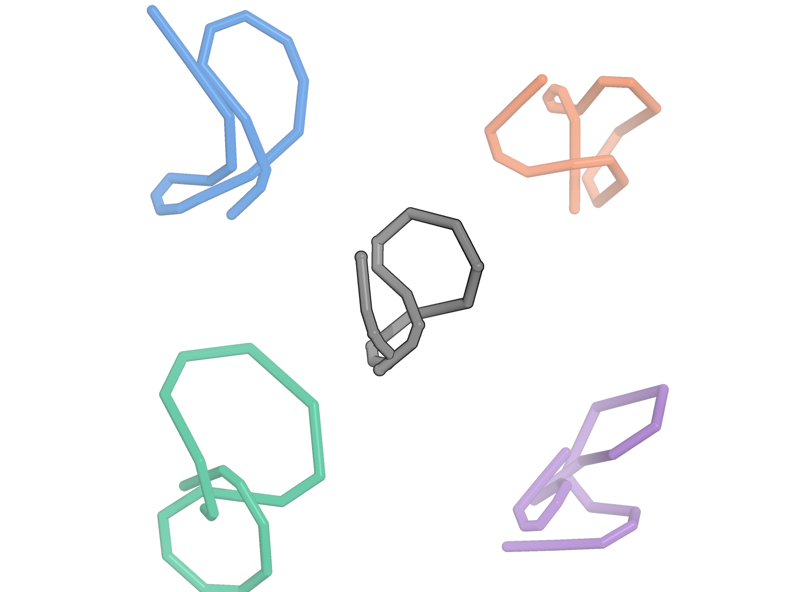

# XM on a controlled multimodal target — giving best-of-K its best shot

**TL;DR.** On a hand-built, *provably* multimodal target in SE(3)^N — the exact
setting where winner-take-all best-of-K coupling selection (XM) is supposed to
help — XM delivers **no improvement in sample purity and eliminates no blur,
because vanilla flow matching already produces zero blur and recovers every
mode.** The premise XM is built on ("the conditional-mean objective smears
genuinely multimodal targets") does not reproduce even in this idealized toy.
XM's only measurable effect is a **small, consistent improvement in mode
*balance*** (more even coverage of the modes) and a hint that it **stabilizes
training** (the one diverged run in 24 was a vanilla arm). Neither touches the
headline generative-quality metric. This corroborates the full-scale protein
result: **plain independent coupling wins.**

Run: `PYTHONPATH=. .venv/bin/python analysis/xm_toy_mixture.py` (CPU-only, ~35 min).
Figure: `docs/assets/xm_toy_mixture.png`. Raw: `xm_eval_results/toy/toy_results.csv`.



## Why this experiment

The paper's motivation for exploration/selection is that a per-example
conditional objective regresses to the *mean* of the posterior over couplings,
which blurs targets that are genuinely multimodal. If that mechanism is real,
the cleanest possible demonstration is a target that is multimodal *by
construction*, with the ground truth known exactly so purity and blur can be
measured directly — no ProteinMPNN/ESMFold/foldseek noise, no data scarcity, no
IPA-capacity confound. If XM cannot win here, it will not win on real proteins.

## What is faithful vs. stripped

Faithful (imported from the training code, not re-implemented):

- **Corruption** — the real `data/interpolant.py`: `corrupt_batch` /
  `corrupt_batch_xm`, shared-`t` / shared-`x_1`, IGSO(3) σ=1.5 rotation prior +
  centered-Gaussian × `NM_TO_ANG_SCALE` translation prior, `min_t=1e-2`.
- **Loss** — the exact `model_step` `trans_loss` + `rots_vf_loss` (weights 2.0 /
  1.0, `trans_scale=0.1`, `t_normalize_clip=0.9`, clamp≤5).
- **Selection** — the real XM rule: K no-grad candidate forwards sharing `t` and
  `x_1`, per-example score = `trans_loss + rots_vf_loss`, backprop only the
  argmin winner.
- **Sampling** — the interpolant's own `_trans_euler_step` / `_rots_euler_step`.

Stripped: IPA → a tiny 3-layer MLP velocity field (predicts clean
`pred_trans`/`pred_rotmats`); real proteins → an explicit mixture of `M=4` rigid
templates in SE(3)^N (`N=8` frames). Each training example = a mode drawn
uniformly + tiny jitter (0.2 Å / 0.03 rad), so the target is exactly 4-modal.
Mode separation is one dial `Δ`: the pairwise template spacing in Å (with a
coupled rotation spread). `Δ=2` = overlapping/hard, `Δ=6` = well-separated.

## The toy problem, visualized (PyMOL)

To make the setup and the result concrete, here are ray-traced CA-traces of the
actual `Δ=6` problem (`N=8` frames, `M=4` modes, seed 0). The four modes are
centered (zero centre-of-mass) so they truly share a centroid; for these figures
only, each mode is shifted into one quadrant of a 2×2 grid — translation is
arbitrary in this CoM-free problem, and the split makes the story legible without
altering any internal shape or orientation.

Export + render (the export is CPU-only; the render needs a PyMOL-capable python):

```
PYTHONPATH=. .venv/bin/python analysis/xm_toy_export.py
/usr/bin/python3.10 analysis/xm_toy_pymol.py
```

**The four ground-truth modes.** Each is a rigid SE(3)^N template; the little
red/green/blue triads are the per-residue rotation frames — this is a genuine
SE(3) target, not a point cloud.



**Vanilla (K=1) vs XM (K=4).** Generated samples are colored by their nearest
mode and overlaid (thin) on the thick reference template of that mode; the grey
trace in the centre is the **mode-average "blur point"** — the conditional-mean
target XM claims vanilla collapses onto. In both arms every sample snaps cleanly
onto one of the four modes and **the blur point sits alone in the empty centre —
no sample lands there** (`blur_rate = 0.000`). Vanilla and XM are visually
indistinguishable, which is exactly the quantitative result.

| vanilla (K=1) | XM (K=4) |
|---|---|
|  |  |

## Metrics (ground truth known exactly)

- **Purity** — distance from each sample to its *nearest* template (combined
  translation-RMSD + mean rotation-geodesic, each normalized by the inter-template
  spacing). Lower = purer. This is the headline.
- **Blur rate** — fraction of samples closer to the *mode-average* ("blur point":
  mean of the templates) than to any single template. This is the exact
  conditional-mean failure XM claims to fix.
- **Mode coverage / balance** — nearest-template histogram over the 4 modes;
  balance = `min_mode_share × M` (1.0 = perfectly even). Catches XM mode-collapse.

## Results (median over 3 seeds; K=1 is the vanilla arm)

| Δ | arm | purity (comb, ↓) | trans (Å, ↓) | rot (rad, ↓) | blur | modes | balance (↑) | diverged |
|---|-----|------------------|--------------|--------------|------|-------|-------------|----------|
| 2 | vanilla (K=1) | 0.038 | 0.038 | 0.029 | 0.00 | 4/4 | 0.81 | 0/3 |
| 2 | XM K=2 | 0.039 | 0.044 | 0.028 | 0.00 | 4/4 | 0.89 | 0/3 |
| 2 | XM K=4 | 0.035 | 0.035 | 0.029 | 0.00 | 4/4 | 0.95 | 0/3 |
| 2 | XM K=8 | 0.037 | 0.041 | 0.027 | 0.00 | 4/4 | 0.92 | 0/3 |
| 6 | vanilla (K=1) | 0.021 | 0.055 | 0.041 | 0.00 | 4/4 | 0.78 | **1/3** |
| 6 | XM K=2 | 0.016 | 0.051 | 0.029 | 0.00 | 4/4 | 0.87 | 0/3 |
| 6 | XM K=4 | 0.017 | 0.049 | 0.031 | 0.00 | 4/4 | 0.90 | 0/3 |
| 6 | XM K=8 | 0.027 | 0.091 | 0.046 | 0.00 | 4/4 | 0.88 | 0/3 |

(Δ=6 vanilla medians exclude seed 2, which diverged: 10,174 Å translation error,
2/4 modes. See below.)

## Reading the result against the pre-registered outcomes

Before running I wrote down what each outcome would mean. The data lands on two
of them at once:

1. **"Vanilla already clean at large Δ ⇒ undercuts the paper's premise."**
   ✔ This is the dominant finding, and it holds at *small* Δ too. **Blur rate is
   0.000 in all 24 runs**, vanilla included; every arm covers 4/4 modes; purity
   is statistically indistinguishable between vanilla and XM at every K. A
   plain conditional flow-matching MLP does not smear these modes — it snaps
   cleanly onto them. There is no blur for XM to remove.

2. **"XM no purity gain ⇒ strong disproof."** ✔ Purity vs K is flat (left panel).
   The much lower *training* loss under XM (e.g. K=8 ≈ 0.03 vs vanilla ≈ 0.18 at
   Δ=2) is the **mechanical min-of-K selection artifact** — XM trains against the
   easiest of K couplings, so its loss number is smaller by construction. It does
   **not** convert into purer samples. This is exactly the trap that makes the
   raw XM training loss a misleading progress signal.

The one thing XM *does* do:

- **Mode balance improves modestly and consistently** with K (right panel):
  ~0.81 → ~0.92–0.95 at Δ=2, ~0.78 → ~0.88–0.90 at Δ=6. Selecting the
  best-fitting coupling per example evens out which modes get served. It is a
  real effect, but small and orthogonal to purity/blur — on real proteins it
  would at best nudge diversity, and the full-scale runs showed diversity did not
  improve either.
- **Stability hint.** The only training divergence across all 24 runs was a
  *vanilla* seed (Δ=6, seed 2). Winner-take-all skips the hardest couplings, so
  it may smooth the loss landscape. This is a single data point — suggestive, not
  conclusive — and if anything argues for OT-style coupling improvement rather
  than XM specifically.

## Verdict

Even with every advantage engineered in its favor — an exactly multimodal
target, no data limits, a metric that measures blur directly — **XM does not
improve sample purity and removes no blur, because the blur it targets does not
occur.** The mechanism's stated premise fails in the controlled setting, which
explains cleanly why it never helped on real backbones. XM's genuine effect is a
minor gain in mode balance (and possibly training stability), neither of which
justifies the K× forward-pass cost. **Consistent with the main study:
independent coupling is the right default.**
