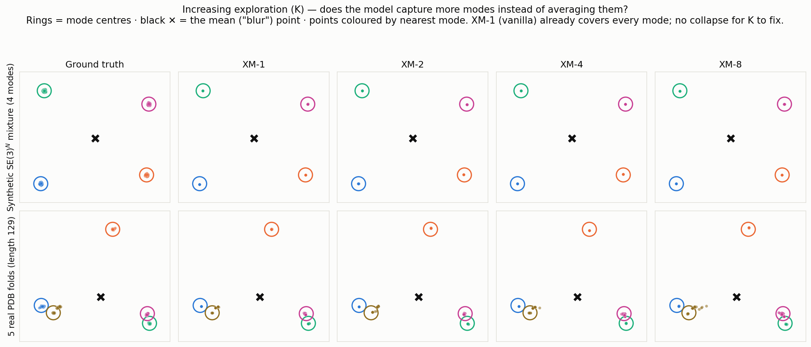
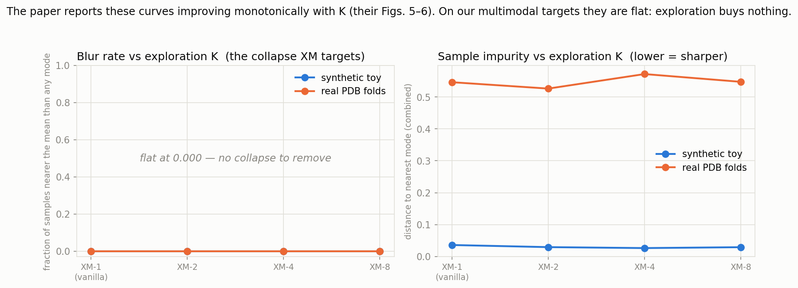
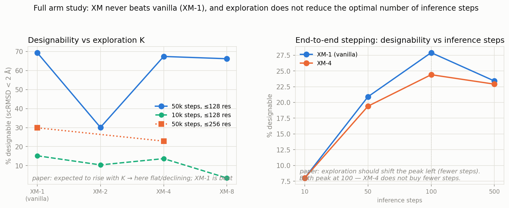

# Explorative Modeling on protein backbones — our results in the paper's own terms

This note re-states our FrameFlow findings using the terminology and figure
language of **Gladstone, Ji & Du, _"Explorative Modeling: Unlocking a Third
Pretraining Axis and End-to-End Generation"_**
([explorative-modeling.github.io](https://explorative-modeling.github.io/)), and
reproduces three of the paper's signature figures on our targets.

## The paper's claim, in its words

The paper introduces **Explorative Models (XMs)**: "wrap your existing loss in a
short for-loop and keep the closest of **K** candidates" (**best-of-K**). Writing
**XM-K**, XM-1 is the ordinary model. Its motivating picture (their **Fig. 1**) is
a synthetic **3-mode Gaussian mixture** where **XM-1 collapses to the mean**
(a "blur") and larger K "**captures more modes instead of averaging them**."
Exploration is pitched as a **third pretraining axis** (alongside data and
parameters) that yields **monotonic** gains — their **Figs. 5–6** show FID/FVD
falling monotonically as K grows — and **end-to-end generation** where "as
exploration increases the optimal number of steps shrinks" (their **Fig. 12**).

Our XM variant is the flow-matching-native one: we **explore over the noise
coupling** (K noise draws sharing the timestep t and the ground-truth x₁, keep the
argmin), rather than the paper's default **Forward XM** (explore over the model's
generations). For a coupling-based generator this is the faithful analog — a
per-example best-of-K over the noise→data pairing.

## Fig. 1 mirror — does exploration capture more modes here?

We rebuild the paper's Fig. 1 on two genuinely multimodal SE(3)ᴺ targets: our
**synthetic mixture** (4 rigid-fold modes) and **5 real, foldseek-clustered PDB
folds** (length 129). Each panel is a 2D PCA projection of the backbone
translations; points are coloured by nearest mode, **stars** mark the mode
centres, and the **black ✕** is the mean — the "blur point" XM-1 is supposed to
collapse onto.

**The paper's premise does not reproduce.** Unlike the paper's 3-mode toy, **XM-1
(vanilla) already lands cleanly on every mode and never piles onto the mean ✕**.
Increasing K (XM-2 → XM-8) changes nothing visible: there is no mean-collapse for
exploration to undo. A conditional flow-matching objective does not blur these
multimodal targets.

## Figs. 5–6 mirror — the "monotonic improvement" curves

The paper's Figs. 5–6 plot a quality metric against exploration K and show it
improving monotonically. We plot the two quantities that would carry that signal
here — **blur rate** (the exact mean-collapse failure) and **sample impurity** —
against K, on both targets.

**Blur rate is 0.000 at every K** (there is no collapse to remove) and **impurity
is flat** — XM-2/4/8 are within seed noise of XM-1. The monotonic improvement the
paper reports on images/video/language **does not appear** on these protein
targets. (XM's *training* loss does fall with K — but that is the mechanical
min-of-K selection artifact, and it does not transfer to sample quality.)

## Figs. 5–6 & 12 mirror — the full arm study

Finally, the headline generative metric on real protein generation
(**designability** = % of backbones with self-consistency scRMSD < 2 Å) versus
exploration K, plus the paper's **end-to-end stepping** view (designability vs
inference steps).

- **Designability vs K** (left): across every regime — 10k & 50k training steps,
  ≤128 & ≤256 residues — **XM-1 (vanilla) is the best**. Larger K is flat-to-worse,
  the opposite of the paper's monotonic rise; at ≤256 residues XM-4 trails vanilla
  by a *wider* margin than at ≤128, so this is **not** a small-/low-multimodality
  artifact. (XM-2 at 50k is broken, not diverse — scattered undesignable samples.)
- **End-to-end stepping** (right): the paper predicts exploration shifts the
  optimum to **fewer** steps. Here **XM-1 and XM-4 both peak at 100 steps** and
  vanilla peaks higher — **exploration buys no step reduction**.

## Bottom line

On protein-backbone flow matching, the mechanism Explorative Modeling is built to
fix — **conditional-mean collapse of multimodal targets** — **does not occur**:
XM-1 already captures every mode with zero blur. Consequently none of the paper's
signatures reproduce here: no monotonic gain with K, no designability improvement,
and no reduction in optimal inference steps. **Plain independent coupling (XM-1)
is the right default.** See [xm_explorative_modeling.md](xm_explorative_modeling.md)
(full study), [xm_real_folds.md](xm_real_folds.md) (real-fold screen), and
[xm_toy_mixture.md](xm_toy_mixture.md) (controlled toy) for the underlying runs.

_Figures: `docs/make_paper_figs.py` (+ `analysis/xm_paper_figs.py` for the Fig. 1
point-cloud data). Reproduces on CPU._
